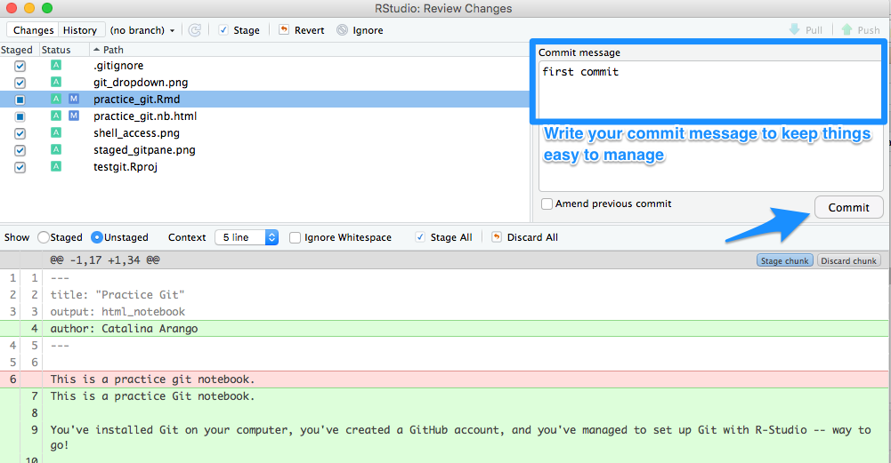

This is a practice Git notebook.

You've installed Git on your computer, you've created a GitHub account, and you've managed to set up Git with R-Studio -- way to go!

But you probably need a little bit of practice actually using Git from R-studio. 

If you're already a pro at Git from the shell, feel free to keep doing your thing. But, if you're not a pro (even if you are) and you want to be really great a using version control best practices when doing data science, then you should familiarize yourself with using the Git tools within R-Studio.

If you have no idea what Git is and how the Git workflow works, now is a really good time to review that! This workbook assumes that you already have some beginner knowledge of the Git workflow, so it mainly focuses on executing those commands from within R-Studio. 

##Pre-reqs
* You've enabled git as the version control system in R-Studio
* You've created an SSH RSA Key and have added it to your Github account
  + Make sure you remember your passphrase (write it down some place safe) as you will have to enter the passphrase when you want to push to or pull from the remote repo

##Accessing the shell
You can of course work with the shell and get to your directory using bash commands, but you are not sure how to navigate through the shell to get to your directory, you can always access the shell via the git pane.

##Creating a remote repo
So, you've gone through the process of **init**iating a Git repo locally by using `git init`, but how do you then make sure you are connecting to a remote repo on GitHub (our server) so that you can share and collaborate on your work?

You have to add (stage) any files that you want to add to your repo first.

Once your files are staged, then you can commit them but selecting the `commit` button in the gitpane (or using the shortcut)

Create a remote repo at https://github.com/new with the same name as your project folder, in my case it is `testgit`.

Once the repo is created, when you first go to repo's main page, you'll see that GitHub provides you with some options to sync the remote repo (on GitHub) with the one you have locally.

Choose the SSH option and copy the text that starts with `git@github.com:<username>/repo.git`

If running `git push` in the shell generates an error, then you'll have to run `git push --set-upstream origin master` at which point you'll be asked to enter your SSH passphrase. This connects your local repo with the remote repo, so that you can now push commits to the remote repo to make them public to others. 

At this point, you've successfully created and synced your remote and local repo -- which means you can now push and pull different versions and branches.

##Additional Info

###Commands for specific pages
The git dropdown on the toolbar allows you to access Git and GitHub commands that apply to the current file you are viewing. You can view the differences from your last tracked changes with the 'diff' command. 

